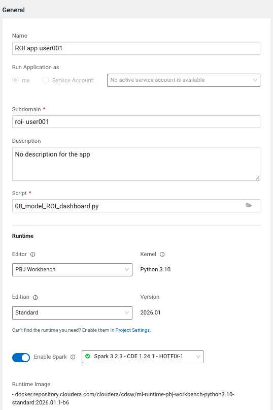
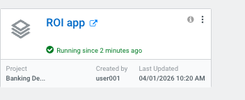
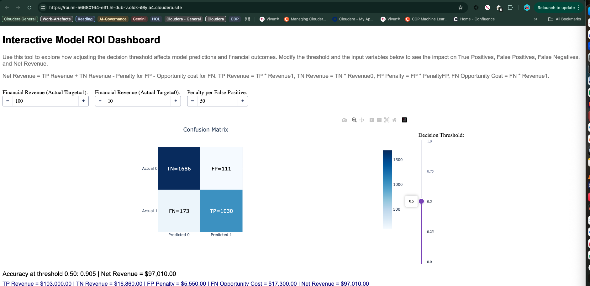

## 05 AI Applications

#### Objective

This guide shows how to create an AI Application in Cloudera AI using the existing `08_model_ROI_dashboard.py` Dash app. You will learn the minimal steps to publish a long‑running, shareable web app and where to find the official documentation.

#### Instructions for Code Execution

1) Read the help document
   - Review Cloudera AI "Analytical Applications" to understand how apps are created and managed:  
     https://docs.cloudera.com/machine-learning/cloud/applications/topics/ml-applications-c.html
   - Notes:
     - Applications run inside their own engine and remain running until stopped.
     - Your app script must serve on `CDSW_APP_PORT` (or `CDSW_READONLY_PORT`). The ROI Dashboard already does this.

2) Create the ROI Dashboard application (no code changes required)
   - Prerequisites:
     - Complete earlier steps so the Iceberg table with transactions exists (from `00_datagen.py`).
     - Ensure project/application environment variables are set: `PROJECT_OWNER`, `DBNAME_PREFIX`, `SPARK_CONNECTION_NAME`.
   - In your project, go to Overview → Applications → New Application and fill in:
     - Name: ROI Dashboard
     - Subdomain: roi-dashboard (or your choice)
     - Script: `08_model_ROI_dashboard.py`
     - Engine/Kernel/Resources: choose PBJ Runtime , Python 3.10
     - Environment Variables: set any required variables not already set at the project level  
       (the platform provides `CDSW_APP_PORT` automatically; do not override it)
   - Click Create Application and wait for the status to become Running. Open the app.

3) Interact with the dashboard
   - Use the threshold slider and financial inputs to see how TP/FP/FN/TN and net revenue change.
   - The app reads the latest Iceberg snapshot and trains an XGBoost model on the incoming batch to power the visualization.

#### Code Highlights

- Uses Cloudera Data Connections to start Spark and read data from the Iceberg table.
- Loads the latest incremental data between parent and current snapshot IDs.
- Trains an `XGBClassifier` and serves an interactive Dash UI (confusion matrix + ROI calculations).
- Binds the server to `CDSW_APP_PORT` so it can run as an AI Application; no code edits are needed.

#### Summary

You created a long‑running web application in Cloudera AI from an existing Dash script without modifying code. The app serves on the platform‑provided port, reads data from Iceberg via Spark, and exposes an interactive ROI dashboard for stakeholders.

#### Related Articles

- Cloudera AI Analytical Applications:  
  https://docs.cloudera.com/machine-learning/cloud/applications/topics/ml-applications-c.html
- Web applications embedded in sessions (for local testing):  
  https://docs.cloudera.com/machine-learning/cloud/projects/topics/ml-embedded-web-apps.html
- Plotly Dash documentation:  
  https://dash.plotly.com/
