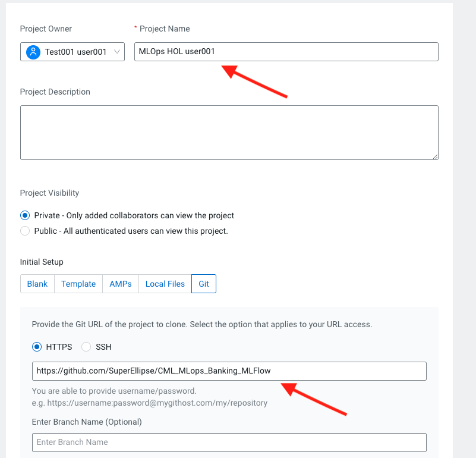
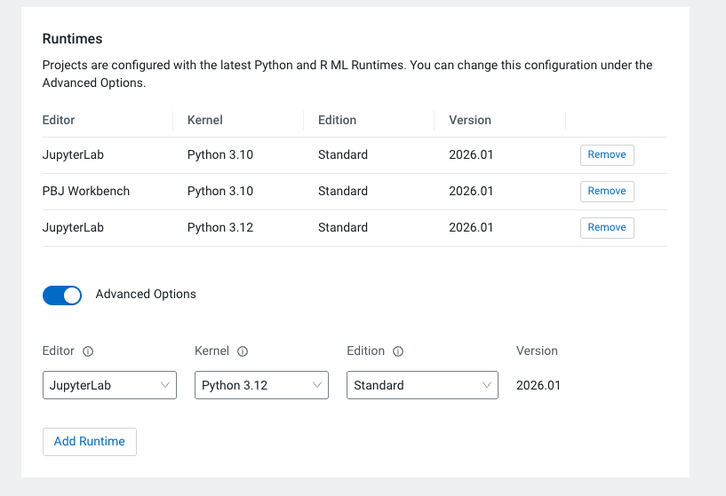
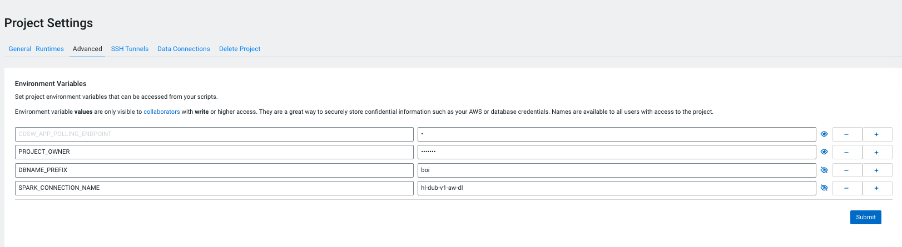
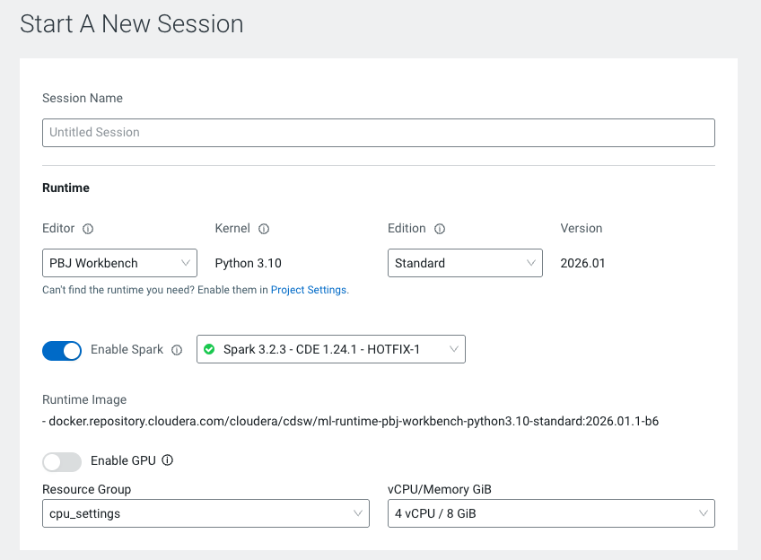

## Setup

### Objective

This document provides instructions for setting up the HOL in your CML Workspace.

### Requirements

* CML Workspace on version xxx with instance types xxx
* CML MLFlow Registry
* CDP User with CML Admin rights and full setup in IDBroker Mappings and Ranger Hadoop SQL / RAZ-related Policies.
* CML Runtime Resource Profile of 2 vCPU and 4 or 8 GiB

### Setup Instructions

1. Deploy CML Project from Git Repository
2. Create a CML Session and Install Requirements

#### 1. Deploy CML Project from Git Repository

From inside the CML Workspace create a new project and enter the following parameters in the form:

```
Project Name: MLOps HOL <username>
Project Visibility: Private or Public
Initial Setup: Git -> https://github.com/SuperEllipse/CML_MLops_Banking_MLFlow
Runtimes:
  1. Make sure you have 3.10 PBJ, 3.10 JupyterLab and 3.12 JupterLab Runtimes the below.
  2. Select Advanced Options
  3. Select: 3.12 Jupyter / Python 3.12 Kernel / Standard Edition / 2026.01 Version for adding the JupyterLab runtime
```





#### 2. Set Project Environment Variables

Set the following environment variables at the Project Settings.

SPARK_CONNECTION_NAME -> Found in Spark Data Connections tab[ ask your Instructor if you are not sure, usually the picture below should give you the details].
DBNAME_PREFIX -> Arbitrary - please use one word without special characters.




#### 3. Create a CML Session and Install Requirements

Launch a CML Session with:

```
Editor: Workbench
Kernel: Python 3.10
Edition: Standard
Version: 2026.01
Enable Spark: Version 3.2.3
Resource Profile: 4 vCPU / 8 GiB Mem / 0 GPU
```

In the prompt on the right side enter the following command:

```
!pip3 install -r requirements.txt
```




Once all packages have been installed, proceed to instructions in 00_datagen.


